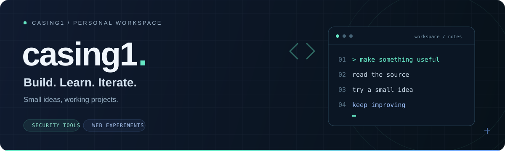

  

  <strong>작은 아이디어를 직접 만들고, 배우고, 다듬습니다.</strong> 
  보안 도구부터 브라우저 게임까지, 프로젝트로 쌓아가는 개발 기록.

  <a href="https://github.com/casing1/authzest">AuthZest</a>
  &nbsp; / &nbsp;
  <a href="https://casing1.github.io/RPG_IDLE/">Play RPG_IDLE</a>
  &nbsp; / &nbsp;
  <a href="https://github.com/casing1?tab=repositories">All repositories</a>

 

## Selected projects

<table>
  <tr>
    <td width="50%" valign="top">
      <h3>01 &nbsp; AuthZest</h3>
      
<strong>FastAPI 소스를 읽는 분석 도구</strong>

      
애플리케이션을 실행하지 않고 라우트와 의존성 선언을 수집해 CLI와 로컬 대시보드에서 살펴봅니다.

      
<code>Python</code> <code>FastAPI</code> <code>React</code>

      
Alpha · 정적 소스 분석

      
<a href="https://github.com/casing1/authzest"><strong>프로젝트 보기 →</strong></a> &nbsp; <a href="https://github.com/casing1/authzest/releases">Releases</a>

    </td>
    <td width="50%" valign="top">
      <h3>02 &nbsp; RPG_IDLE</h3>
      
<strong>브라우저에서 즐기는 방치형 RPG</strong>

      
스테이지 진행, 장비 수집과 합성, 던전 탐험을 담은 프로토타입. 로컬 저장과 오프라인 보상을 지원합니다.

      
<code>TypeScript</code> <code>JavaScript</code> <code>CSS</code>

      
Prototype · GitHub Pages

      
<a href="https://casing1.github.io/RPG_IDLE/"><strong>플레이하기 →</strong></a> &nbsp; <a href="https://github.com/casing1/RPG_IDLE">Source</a>

    </td>
  </tr>
</table>

 

## In the toolbox

프로젝트에서 사용하는 언어와 도구입니다.

  
  
  
  
  
  

 

---

  하나씩 만들고, 조금씩 더 낫게. &nbsp; · &nbsp; <a href="https://github.com/casing1?tab=repositories">Explore the workspace ↗</a>

