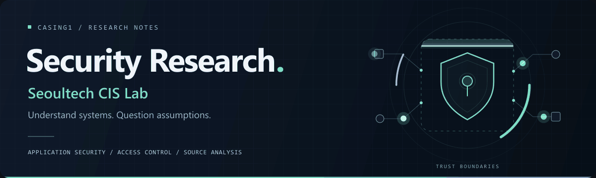

  

  <strong>Seoultech CIS Lab</strong> 
  Understanding systems. Exploring security boundaries. 
  A personal space for security research and source code analysis.

 

## Research interests

  <strong>Application Security</strong> &nbsp; · &nbsp;
  <strong>Access Control</strong> &nbsp; · &nbsp;
  <strong>Source Code Analysis</strong>

I am interested in how applications enforce access control and how those decisions are reflected in source code.

 

## Security research milestones

| Milestone | Status |
| :--- | :--- |
| **Bug bounty rewards** | 2 rewards received |
| **CVE ID reservation** | Reserved · not yet published |

Program and project names, reward amounts, and the CVE identifier are withheld.

 

## Featured project

<table>
  <tr>
    <td>
      <h3><a href="https://github.com/casing1/authzest">AuthZest</a></h3>
      
<strong>Source analysis for reviewing access control in FastAPI applications.</strong>

      
Inventories routes and dependency declarations without executing the application, and links the results to their original source locations.

      
Alpha · Currently provides static source analysis. Authentication and authorization classification, and vulnerability detection, are not yet implemented.

      
Static analysis &nbsp; / &nbsp; Route &amp; dependency inventory &nbsp; / &nbsp; Source evidence

      

        <a href="https://github.com/casing1/authzest"><strong>Repository →</strong></a>
        &nbsp; · &nbsp;
        <a href="https://github.com/casing1/authzest/tree/main/docs">Documentation</a>
        &nbsp; · &nbsp;
        <a href="https://github.com/casing1/authzest/releases">Releases</a>
      

    </td>
  </tr>
</table>

 

## Contact

| | Email |
| :--- | :--- |
| **Academic** | <a href="mailto:ehgis2344@seoultech.ac.kr">ehgis2344@seoultech.ac.kr</a> |
| **Personal** | <a href="mailto:ehgis2344@gmail.com">ehgis2344@gmail.com</a> |

 

---

  Understand systems. Question assumptions.

